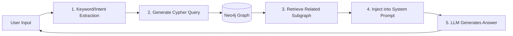

# Epsilon Phase 3 Development Guide: Long-term Memory & Knowledge Graph (GraphRAG)

## 1. Project Overview & Core Objectives

**Current Status**: Phase 2 completed (LLM Chat + Streaming TTS).
**Phase 3 Goal**: Implement a "Living Memory" system using Neo4j.
**Core Problems to Solve**:
1.  **Amnesia**: The agent currently does not recall past interactions.
2.  **Data Quality**: Prevent duplicate/spammy data entry into the graph.
3.  **Relevance**: Only remember important facts, not chit-chat.

**Technical Stack**:
- **Database**: Neo4j Aura (Managed Service)
- **Driver**: `neo4j` Python Driver (v5.x, Async/Sync)
- **Visualization**: `react-force-graph` (Frontend)
- **Logic**: Custom GraphRAG (Retrieval-Augmented Generation)

---

## 2. System Architecture: The "Recall & Remember" Loop

We are introducing a **Dual-Loop Architecture**:

### 2.1 The "Recall" Loop (Synchronous - Happens BEFORE Reply)
*Goal: Solve "AI doesn't remember anything".*



### 2.2 The "Remember" Loop (Asynchronous - Happens AFTER Reply)
*Goal: Solve "Duplicate content" and "Focus on importance".*

```mermaid
graph LR
    History[Chat Buffer (5-10 msgs)] --> Summarizer[1. LLM Summarization]
    Summarizer --> Extractor[2. Entity Extraction + Scoring]
    Extractor --> Dedupe[3. Deduplication Check]
    Dedupe --> Write[4. MERGE into Neo4j]
```

---

## 3. Detailed Implementation Plan

### 3.1 Infrastructure: Neo4j Configuration

**Connection Details** (Based on `Neo4j-c9810bad-Created-2025-12-10.txt`):
*   **URI**: `neo4j+s://c9810bad.databases.neo4j.io` (Encrypted)
*   **Auth**: User/Password from environment variables.
*   **Driver**: Use `neo4j` Python driver with `execute_read` and `execute_write`.

**Configuration (`backend/app/config.py`)**:
```python
from pydantic_settings import BaseSettings

class Settings(BaseSettings):
    # ... existing configs ...
    
    # Neo4j Settings
    NEO4J_URI: str = "neo4j+s://c9810bad.databases.neo4j.io"
    NEO4J_USER: str = "neo4j"
    NEO4J_PASSWORD: str = "" # Set in .env
    
    # Memory Logic Settings
    MEMORY_THRESHOLD_SCORE: int = 6  # Only remember facts with score >= 6
    MEMORY_BUFFER_SIZE: int = 5      # Process memory every 5 messages
```

### 3.2 Logic Part 1: "Recall" (Reading Memory)

**The Problem**: How to find relevant memories?
**The Solution**: Topic-based Subgraph Retrieval.

**Step 1: Context Injection in `llm_service.py`**
Update the main chat function to accept a `memory_context` string.

```python
# System Prompt Template Update
SYSTEM_PROMPT = """
You are Epsilon.
...
[Long-term Memory]
The following is what you remember about the user and relevant topics:
{memory_context}
...
"""
```

**Step 2: Retrieval Logic (`memory_service.py`)**

```python
    async def retrieve_context(self, user_id: str, current_message: str) -> str:
        """
        Retrieves relevant memory based on the current message content.
        Strategy: Keyword Matching + Related Neighbor Search
        """
        # 1. Simple keyword extraction (can be improved with LLM later)
        # For now, we split by space or use simple NLP to get nouns
        keywords = self._extract_keywords_simple(current_message) 
        
        if not keywords:
            return "No specific memory found."

        # 2. Cypher Query: Find nodes matching keywords and their direct neighbors
        # We look for User -> (Entity) where Entity name matches keywords
        query = """
        MATCH (u:User {id: $user_id})-[r]-(e:Entity)
        WHERE any(k IN $keywords WHERE toLower(e.name) CONTAINS toLower(k))
        RETURN e.name, type(r), e.properties, e.importance
        ORDER BY e.importance DESC, e.updated_at DESC
        LIMIT 5
        """
        
        # 3. Format result as natural language
        # "You know that the user is interested in Python (Score: 8)."
        return formatted_string
```

### 3.3 Logic Part 2: "Remember" (Writing Memory)

**The Problem**: Duplicate and useless data.
**The Solution**: Summarization, Scoring, and Deduplication.

**Entity Schema Strategy**:
*   **Nodes**: `User`, `Topic`, `Project`, `Skill`, `Person`.
*   **Properties**: `name` (ID), `importance` (1-10), `last_verified` (Date).

**Step 1: The Extraction Prompt (Used in `memory_service.py`)**

```text
Review the following conversation. Extract ONLY persistent facts about the User.
Ignore chit-chat, greetings, or temporary emotions.

For each fact, extract:
1. Entity Name (e.g., "Python", "Epsilon Project")
2. Entity Type (Skill, Project, Topic, Person)
3. Relationship (e.g., LIKES, WORKING_ON, KNOWS)
4. Importance Score (1-10): 10 is critical core identity, 1 is trivia.

Return JSON:
[
  {"name": "Python", "type": "Skill", "relation": "HAS_SKILL", "score": 8},
  {"name": "Spicy Food", "type": "Preference", "relation": "LIKES", "score": 3}
]
```

**Step 2: Deduplication Logic (In Python)**

```python
    async def save_memory(self, user_id: str, extracted_entities: list):
        """
        Saves entities with deduplication and scoring check.
        """
        for entity in extracted_entities:
            # 1. Skip low importance
            if entity['score'] < self.settings.MEMORY_THRESHOLD_SCORE:
                continue
                
            # 2. Normalize Name (Deduplication helper)
            # e.g., "Python 3.10" -> "python" (basic logic)
            normalized_name = entity['name'].lower().strip()
            
            # 3. Write to Neo4j using MERGE (Idempotent)
            # MERGE ensures we don't create duplicates if ID matches
            query = """
            MATCH (u:User {id: $user_id})
            MERGE (e:Entity {id: $norm_name})
            ON CREATE SET e.name = $original_name, e.created_at = datetime()
            SET e.type = $type, 
                e.importance = $score,
                e.last_seen = datetime()
            
            MERGE (u)-[r:RELATION {type: $rel_type}]->(e)
            SET r.updated_at = datetime()
            """
```

---

## 4. Frontend Visualization (Knowledge Graph)

**Goal**: Show the user what Epsilon knows.

**Components**:
1.  **`KnowledgeGraphViewer.tsx`**: Uses `react-force-graph-2d` or `3d`.
2.  **API**: `GET /api/memory/graph` returns nodes and links formatted for the library.

**Features**:
*   **Node Color by Type**: Projects (Blue), Skills (Green), Topics (Orange).
*   **Size by Importance**: Larger nodes = Higher importance score.
*   **Click to Inspect**: Show details and `last_seen` date.

---

## 5. Development Task Checklist

### Phase 3.1: Foundation & "Recall" (Priority: High)
- [ ] **Infrastructure**:
    - [ ] Install `neo4j` driver.
    - [ ] Configure `neo4j+s` connection in `.env`.
    - [ ] Create basic indexes in Neo4j (via Browser).
- [ ] **Memory Service (Read Side)**:
    - [ ] Implement `Neo4jClient` class with `execute_read`.
    - [ ] Implement `retrieve_context(user_id, query)` method.
- [ ] **Chat Integration**:
    - [ ] Modify `/chat` endpoint to call `retrieve_context`.
    - [ ] Inject result into System Prompt.
    - [ ] **Verify**: Ask Epsilon "What projects am I working on?" (Should fail now, pass after writing test data).

### Phase 3.2: "Remember" Logic (Priority: High)
- [ ] **LLM Extraction**:
    - [ ] Create the "Extraction Prompt" (with scoring).
    - [ ] Implement `extract_facts_from_text` function.
- [ ] **Memory Service (Write Side)**:
    - [ ] Implement `save_memory` with `MERGE` logic.
    - [ ] Implement background task or hook to trigger saving after N messages.
- [ ] **Testing**:
    - [ ] Chat about a topic.
    - [ ] Check Neo4j Browser to see if nodes appear.
    - [ ] Chat again to see if Epsilon references the new node.

### Phase 3.3: Visualization (Priority: Medium)
- [ ] **Backend API**:
    - [ ] Implement `GET /api/graph` (return D3-like JSON).
- [ ] **Frontend**:
    - [ ] Install `react-force-graph`.
    - [ ] Create Graph View component.
    - [ ] Add "Memory" tab to the UI.

---

## 6. How to Start

1.  **First**, create the `MemoryService` and connect to Neo4j.
2.  **Second**, manually insert a dummy fact into Neo4j Browser:
    ```cypher
    MERGE (u:User {id: "user_1"})
    MERGE (p:Project {id: "epsilon", name: "Epsilon Project"})
    MERGE (u)-[:WORKING_ON]->(p)
    ```
3.  **Third**, update the Chat API to query this.
4.  **Finally**, verify that Epsilon says "You are working on the Epsilon Project" without you mentioning it in the current prompt.

This document serves as the master plan. Let's start coding Phase 3.1.

